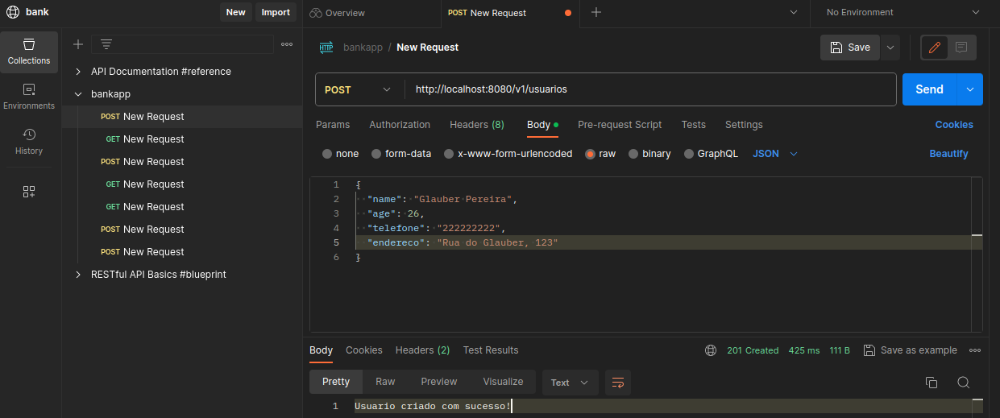

# Bankapp

Projeto usando Quarkus e banco de dados Mysql.

RESTful API de um banco que permite:
Cadastrar Usuário
Detalhar Usuário
Listar Todos Usuários
Detalhar Contas
Cadastrar Contas
Sacar Valor da Conta
Depositar Valor da Conta





### :floppy_disk: Download - Para clonar o repositório


#### com a chave ssh:

##### 1. Abra o seu terminal e clone o código com o comando

    git@github.com:ericafnunes/bank-rest.git

#### com o protocolo https:

##### 2. Abra o seu terminal e clone o código com o comando

    https://github.com/ericafnunes/bank-rest.git


### Running the application

You can run your application in dev:
```shell script
./mvnw compile quarkus:dev
```

## Documentação da API:

Para testar a API, você pode baixar a coleção do Postman 

[](https://app.getpostman.com/run-collection/31829534-a0513a4e-11d8-4bfe-933c-65075eb3ec6d?action=collection%2Ffork&source=rip_markdown&collection-url=entityId%3D31829534-a0513a4e-11d8-4bfe-933c-65075eb3ec6d%26entityType%3Dcollection%26workspaceId%3D0bce6f88-80c9-4dde-814a-eac9cb0ab9e1)